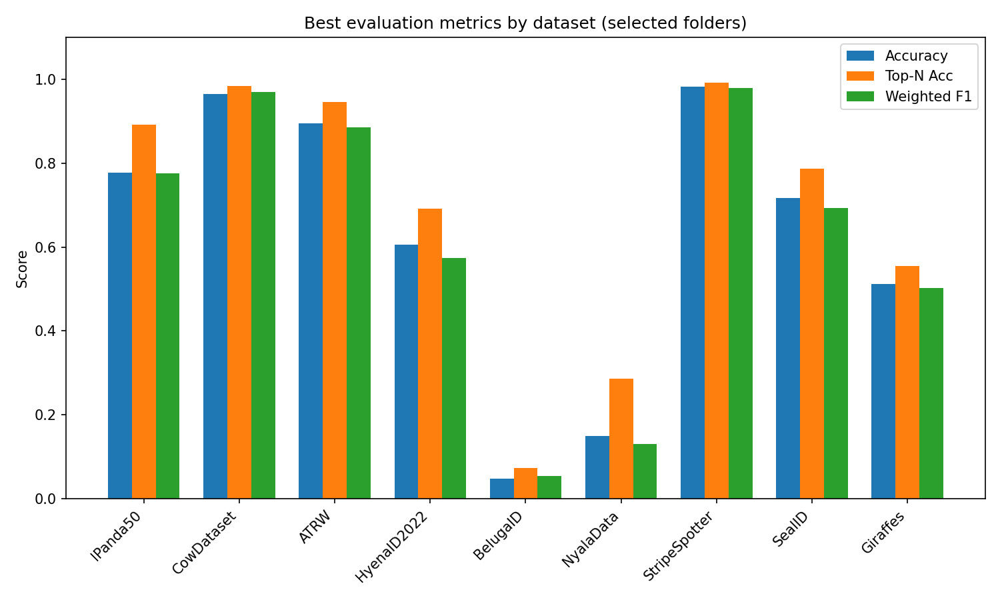
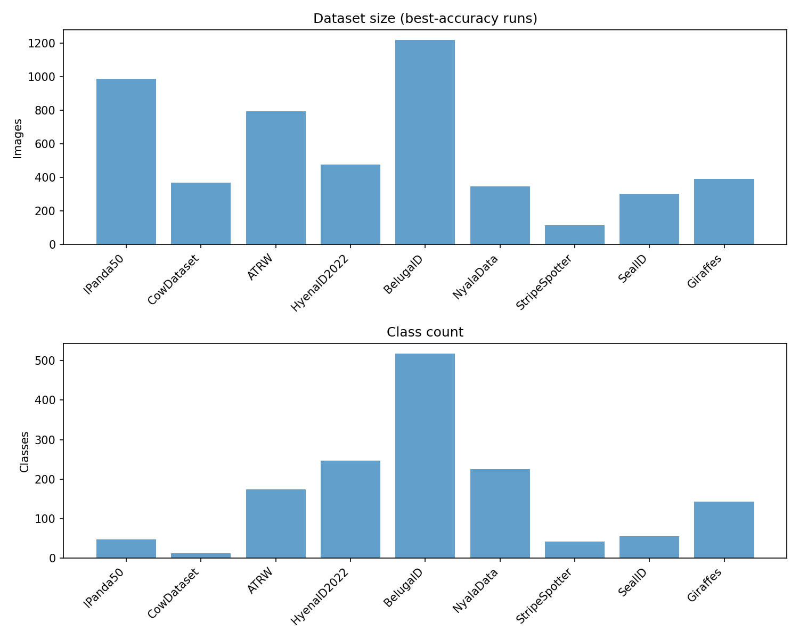
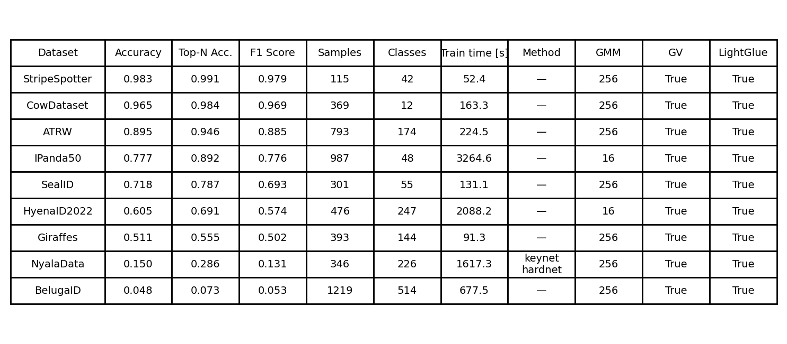

# **Master's Thesis Deep Learning-based Animal Re-Identification for Non-invasive Wildlife Monitoring and Conservation**


---

## **Set up**

To set up the project on your computer, follow these steps:

1. Klonirajte Git repozitorij s uključenim podmodulima:
   ```bash
   git clone --recursive-submodules https://github.com/matejmaricIA/Animal-Re-Identification---MSc-Project.git
   ```
2. Update the submodules:
   ```bash
   git submodule update --init --recursive
   ```
3. Create a Python virtual environment:
   ```bash
   python3 -m venv venv
   ```
4. Activate the virtual environment:
   - **Linux/MacOS**:
     ```bash
     source venv/bin/activate
     ```
   - **Windows**:
     ```bash
     venv\Scripts\activate
     ```
5. Install the required libraries:
   ```bash
   pip install -r requirements.txt
   ```

---

## **Using the project**

The project supports two primary modes: **model training** and **inference (prediction)**. Training is mostly used for testing purposes on the wildlifereid-10k datasets, inference is used for creating a database from a dataset of images and approximating the number of unique individuals.

### **1. Model training**

Train a model on a chosen dataset (e.g. ATRW) with:
```bash
python main.py --train --ds ATRW --use_geometric_verification --use_lightglue --method keynet_hardnet --save_eval
```

- **`--train`**: Launches training mode.
- **`--ds`**: Selects the dataset to train (e.g. ATRW).
- **`--save_eval`**: Saves evaluation results to `./data/evaluations`.
 **`--version`**:  version tag of the method in use. Together with background-removal and tone-mapping settings it forms a “tag” used to store results in a sub-directory of evaluations/. Optional argument and not important for the training itself.
- **`--use_lightglue`**: Uses the LightGlue matcher during geometric verification.
- **`--gv_matcher`**: Selects the geometric verification matcher (`ratio`, `lightglue`, or `loftr`). LoFTR requires image paths from baseline or processed datasets.

- **`--use_global_embedding`**: Use global CNN/Transformer embeddings.
- **`--embedding_model`**: Backbone for global embeddings (`resnet50`,
   `megadescriptor-l-384`, or DINOv2 variants like `dinov2_vits14` /
   `dinov2_vitb14` / `dinov2_vitl14` / `dinov2_vitg14` and `_reg4` versions). The
   `megadescriptor-l-384` encoder is downloaded from
   [`BVRA/MegaDescriptor-L-384`](https://huggingface.co/BVRA/MegaDescriptor-L-384)
   via `timm`.
- **`--w_fisher`, `--w_global`**: Weights for Fisher vectors and global embeddings when fusing descriptor blocks.


  
During training:
- Data are split into train and test sets.
- **PCA** and **GMM** models are fitted to the features.
- Evaluation reports accuracy and top-N accuracy on the test set.

All results are saved to the project's predefined directories.

### **2. Inference (Prediction)**

Run predictions on new images with:
```bash
python main.py --predict --ds ATRW --image_location /path/to/dir
```

- **`--predict`**: Enables prediction mode.
- **`--ds`**: Dataset whose trained models will be used as the reference database. (obsolete)
- **`--image_location`**: Directory containing the images to analyse.

During inference:
- TO DO

---

### **3. Counting Individuals**

Estimate the number of unique individuals in a dataset using the Nested Importance Sampling approach:

```bash
python main.py --count --ds ATRW --num_vertices 150 --num_neighbors 20
```

- **`--count`**: Enables population size estimation.
- **`--num_vertices`**: Number of sampled vertices.
- **`--num_neighbors`**: Number of neighbours per vertex.
- **`--automated_mode`**: Use fully automated counting without human labels (faster but potentially less accurate).
- **`--use_global_embedding`**: Include global image embeddings (ResNet50,
  MegaDescriptor-L-384, or DINOv2) to enhance Fisher vector representations.
- **`--embedding_model`**: Choose the global embedding model (`resnet50`,
  `megadescriptor-l-384`, or DINOv2 variants like `dinov2_vits14` /
  `dinov2_vitb14` / `dinov2_vitl14` / `dinov2_vitg14` and `_reg4` versions).
- **`--w_fisher`, `--w_global`**: Descriptor fusion weights (same as in training).


#### Automated vs Human-in-the-Loop Modes

**Human-in-the-Loop Mode (default)**:
```bash
python main.py --count --ds ATRW --use_geometric_verification --use_lightglue
```
- Uses geometric verification to filter pairs
- Queries ground truth labels only for geometrically consistent pairs
- More accurate but requires labeled data

**Fully Automated Mode**:
```bash
python main.py --count --ds ATRW --use_geometric_verification --use_lightglue --automated_mode
```
- Uses only geometric verification without any labels
- Faster execution and works with unlabeled data
- Assumes geometric consistency = same individual

**Enhanced Mode with Global Embeddings**:
```bash
python main.py --count --ds ATRW --use_geometric_verification --use_lightglue --automated_mode --use_global_embedding
```
- Combines Fisher vectors with configurable global image embeddings
- Potentially more robust individual recognition
- Slightly longer processing time due to CNN feature extraction

## **Data Structure**

- **Dataset**: `./data/<DATASET_NAME>/`
- **Segmented data**: `./data/<DATASET_NAME>/segmented_dataset/`
- **Trenirani modeli i značajke**:
  - PCA model: `./data/<DATASET_NAME>/pca_model.pkl`
  - GMM model: `./data/<DATASET_NAME>/gmm_model.pkl`
  - Fisher vectors: `./data/<DATASET_NAME>/fisher_vectors.pkl`

---

## **Napomene**

- **Podrška za GPU**: Aplikacija koristi GPU za ubrzanje rada. Ako GPU nije dostupan, automatski će se koristiti CPU.
- **Memory warning**: `load_descriptors()` and `stack_all_descriptors()` currently load full `descriptors.h5` into RAM. Very large datasets (e.g., aerialcattle2017) can exceed memory and be OOM‑killed; consider a streaming/partial‑load approach when working with huge descriptor files.

## **Rezultati**

Pregled rezultata na testiranim skupovima podataka:



Pregled skupova podataka:


### Tablica Rezultata



Za dodatne informacije ili pomoć, obratite se na [kontakt](mailto:matej.maric99@gmail.com).
