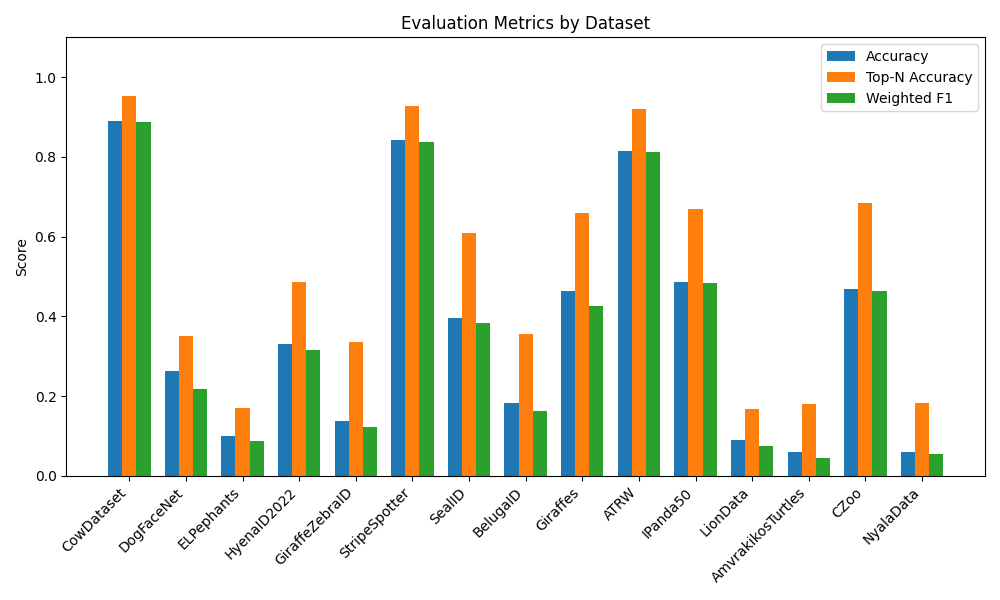
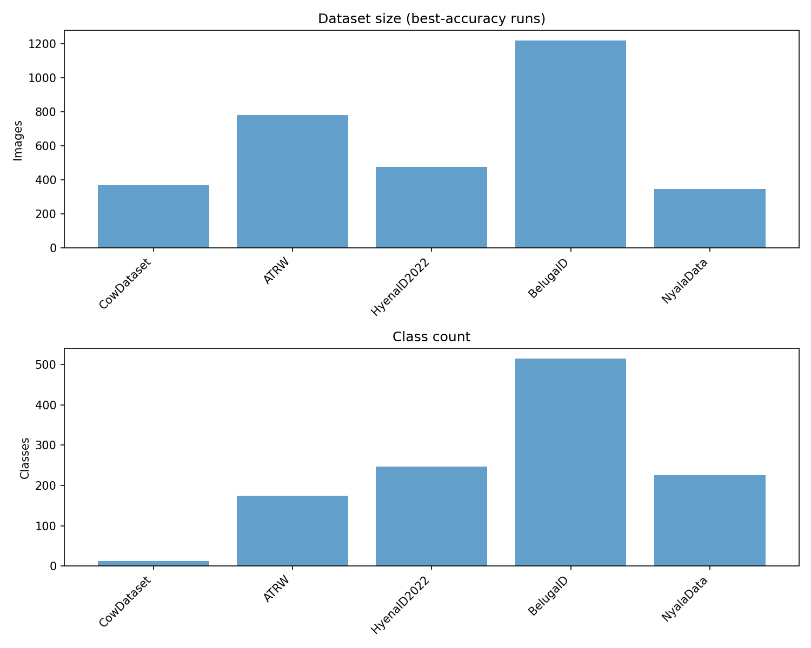

# **Master's Project Animal Re-Identification Application**


---

## **Instalacija**

Za postavljanje aplikacije na vašem računalu, slijedite sljedeće korake:

1. Klonirajte Git repozitorij s uključenim podmodulima:
   ```bash
   git clone --recursive-submodules https://github.com/matejmaricIA/Animal-Re-Identification---MSc-Project.git
   ```
2. Ažurirajte podmodule:
   ```bash
   git submodule update --init --recursive
   ```
3. Kreirajte virtualno okruženje za Python:
   ```bash
   python3 -m venv venv
   ```
4. Aktivirajte virtualno okruženje:
   - **Linux/MacOS**:
     ```bash
     source venv/bin/activate
     ```
   - **Windows**:
     ```bash
     venv\Scripts\activate
     ```
5. Instalirajte potrebne biblioteke:
   ```bash
   pip install -r requirements.txt
   ```

---

## **Korištenje aplikacije**

Aplikacija podržava dva glavna načina rada: **treniranje modela** i **inferenciju (predikciju)**.

### **1. Treniranje modela**

Za treniranje modela na odabranom datasetu (npr. ATRW), koristite naredbu:
```bash
python main.py --train --ds ATRW --save_eval
```

- **`--train`**: Pokreće aplikaciju u načinu treniranja.
- **`--ds`**: Specificira dataset koji će se koristiti za treniranje (npr. `ATRW`).
- **`--save_eval`**: Sprema rezultate evaluacije u direktorij `data/evaluations`.

Tijekom treniranja:
- Podaci će biti podijeljeni u trening i test skupove.
- Modeli **PCA** i **GMM** bit će istrenirani na značajkama.
- Evaluacija će prikazati točnost i top-N točnost na testnom skupu.

Rezultati treniranja bit će spremljeni u definirane direktorije u projektu.

### **2. Inferencija (predikcija)**

Za izvođenje predikcija na novim slikama koristite naredbu:
```bash
python main.py --predict --ds ATRW --image_location /path/to/dir
```

- **`--predict`**: Omogućuje način rada za predikciju.
- **`--ds`**: Dataset korišten za treniranje na kojem je bazirana baza podataka.
- **`--image_location`**: Specificira direktorij sa slikama za analizu.

Tijekom predikcije:
- Pozadina slika bit će uklonjena, a slike će biti obrađene.
- Generirat će se Fisher vektori za svaku sliku.
- Predikcije će uključivati predviđenu klasu i top-N podudaranja.

---

## **Struktura podataka**

- **Dataset**: `./data/<IME_DATASETA>/`
- **Segmentirani podaci**: `./data/<IME_DATASETA>/segmented_dataset/`
- **Trenirani modeli i značajke**:
  - PCA model: `./data/<IME_DATASETA>/pca_model.pkl`
  - GMM model: `./data/<IME_DATASETA>/gmm_model.pkl`
  - Fisher vektori: `./data/<IME_DATASETA>/fisher_vectors.pkl`

---

## **Napomene**

- **Podrška za GPU**: Aplikacija koristi GPU za ubrzanje rada. Ako GPU nije dostupan, automatski će se koristiti CPU.

## **Rezultati**

Pregled rezultata na testiranim skupovima podataka:



Pregled skupova podataka:


### Tablica Rezultata

<!-- MARKDOWN-AUTO-DOCS:START (CODE:src=./evaluations/visualizations/evaluation_table.md) -->
<!-- The below code snippet is automatically added from ./evaluations/visualizations/evaluation_table.md -->
```md
| Dataset | Accuracy | Top-N Accuracy | Weighted F1 | Samples | Classes |
|:---:|---:|---:|---:|---:|---:|
| CowDataset | 0.889 | 0.953 | 0.888 | 297 | 13 |
| DogFaceNet | 0.264 | 0.350 | 0.219 | 1732 | 1393 |
| ELPephants | 0.100 | 0.169 | 0.086 | 431 | 273 |
| HyenaID2022 | 0.332 | 0.487 | 0.316 | 630 | 256 |
| GiraffeZebraID | 0.138 | 0.335 | 0.122 | 1503 | 1304 |
| StripeSpotter | 0.841 | 0.927 | 0.837 | 164 | 44 |
| SealID | 0.396 | 0.609 | 0.384 | 417 | 57 |
| BelugaID | 0.182 | 0.355 | 0.162 | 1277 | 665 |
| Giraffes | 0.463 | 0.660 | 0.425 | 268 | 178 |
| ATRW | 0.814 | 0.920 | 0.813 | 1075 | 182 |
| IPanda50 | 0.485 | 0.669 | 0.483 | 1375 | 50 |
| LionData | 0.090 | 0.168 | 0.074 | 155 | 94 |
| AmvrakikosTurtles | 0.060 | 0.180 | 0.043 | 50 | 50 |
| CZoo | 0.468 | 0.686 | 0.462 | 423 | 24 |
| NyalaData | 0.061 | 0.182 | 0.055 | 428 | 236 |
```
<!-- MARKDOWN-AUTO-DOCS:END -->


Za dodatne informacije ili pomoć, obratite se na [kontakt](mailto:matej.maric99@gmail.com).
